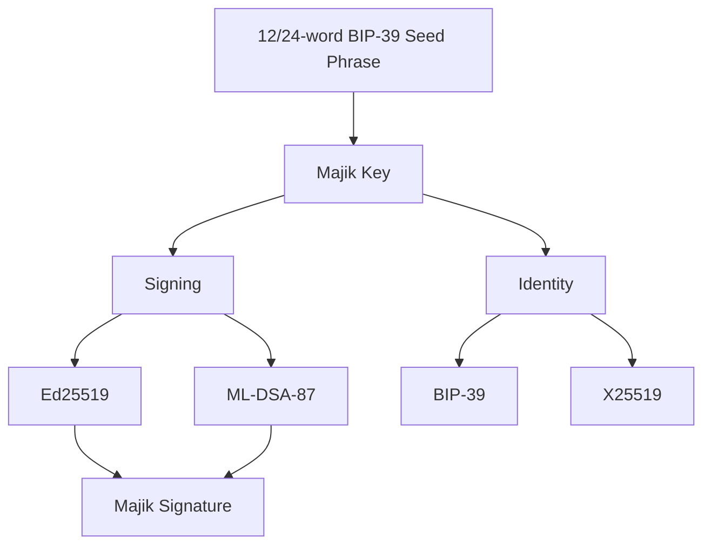

# Majik Signature

[](https://thezelijah.world) 
   [](https://opensource.org/licenses/Apache-2.0)  [](https://www.iana.org/assignments/media-types/application/vnd.majikah.mjksig)

**Majik Signature** is a hybrid post-quantum content signing and verification library for the Majikah ecosystem. Built on top of [**Majik Key**](https://www.npmjs.com/package/@majikah/majik-key), it produces tamper-evident, forgery-resistant digital signatures for any content — plaintext, JSON, PDFs, audio, video, Office documents, or raw binary — using a dual-algorithm architecture that combines classical **Ed25519** with post-quantum **ML-DSA-87** (FIPS-204).

Beyond signing raw bytes, Majik Signature can **embed signatures directly into a file's native format**, or produce **detached envelopes** that travel independently of the file — as portable JSON, base64, or a dedicated self-describing binary container (`.mjksig`). It supports **multi-party signing**, **signing allowlists**, **envelope sealing**, **trusted timestamps (TSA)**, **batch/folder signing** via a manifest format (`.mjksmap`), **chronological signing-order verification**, and **blockchain anchor registration**.

---

## Table of Contents

- [Why Majik Signature](#why-majik-signature)
- [Security Architecture](#security-architecture)
- [Overview](#overview)
- [Features](#features)
- [Installation](#installation)
- [Quick Start](#quick-start)
  - [Signing Raw Content](#signing-raw-content)
  - [File Embedding](#file-embedding)
  - [Detached Signing](#detached-signing)
  - [Multi-Signature Files & Allowlists](#multi-signature-files--allowlists)
  - [Sealing an Envelope](#sealing-an-envelope)
  - [Trusted Timestamps (TSA)](#trusted-timestamps-tsa)
  - [Batch Signing a Folder](#batch-signing-a-folder)
  - [Verifying Signing Order](#verifying-signing-order)
  - [Chain Anchoring](#chain-anchoring)
- [API Reference](#api-reference)
  - [Content Signing](#content-signing-bytesstrings)
  - [File Embedding](#file-embedding-api)
  - [Detached Signing & MajikSignatureEnvelope](#detached-signing--majiksignatureenvelope-api)
  - [Multi-Signature & Allowlist](#multi-signature--allowlist-api)
  - [Sealing](#sealing-api)
  - [Trusted Timestamps](#trusted-timestamps-api)
  - [Batch Signing & MajikSignatureMap](#batch-signing--majiksignaturemap-api)
  - [Signature Order Verification](#signature-order-verification-api)
  - [Chain Anchoring API](#chain-anchoring-api)
  - [Image Stamping (Experimental)](#image-stamping-experimental)
  - [Serialization](#serialization)
- [Supported File Formats](#supported-file-formats)
- [Signature & Envelope Structure](#signature--envelope-structure)
- [Binary Container Formats (MJKSIG / MJKSMAP)](#binary-container-formats-mjksig--mjksmap)
- [Error Handling](#error-handling)
- [Security Considerations](#security-considerations)
- [The Majikah Ecosystem](#the-majikah-ecosystem)
- [Related Projects](#related-projects)
- [Contributing](#contributing)
- [License](#license)
- [Author](#author)
- [Contact](#contact)

---

## Why Majik Signature

Most "digital signature" libraries only sign raw bytes and leave you to figure out storage, transport, and file compatibility yourself. Majik Signature is built to be dropped into a real application:

- **Hybrid post-quantum by default** — every signature is Ed25519 + ML-DSA-87, not an opt-in extra.
- **Signatures live inside the file, or travel detached** — embed directly into the file's native format, or produce a portable envelope (JSON, base64, or the self-describing `.mjksig` binary container) for out-of-band verification workflows.
- **Multi-party signing is a first-class concept** — not bolted on. Allowlists, sealing, issuer semantics, and chronological order verification are part of the core envelope model.
- **Batch-aware** — sign or verify an entire folder or zip's contents against a single manifest (`.mjksmap`) instead of tracking one signature file per asset.
- **Deterministic by design** — the library goes out of its way to guarantee that signing and verifying the same content always produces the same canonical bytes (see [Signature & Envelope Structure](#signature--envelope-structure)).
- **No native dependencies** — pure TypeScript/WASM-free cryptography, works identically in Node.js, browsers, Tauri, Deno, and Bun.

---

## Security Architecture



### 1. Hybrid Dual-Algorithm Signing

Every Majik Signature is produced by **two independent signing algorithms** over the same canonical payload:

- **Ed25519** — classical elliptic curve signature (128-bit security, 64-byte signature)
- **ML-DSA-87 (FIPS-204)** — post-quantum lattice-based signature (NIST Category 5, ~4595-byte signature)

Verification requires **both** to pass. This means:
- A classical attacker breaking Ed25519 still cannot forge the ML-DSA-87 signature.
- A quantum attacker breaking ML-DSA-87 still cannot forge the Ed25519 signature.
- No single algorithmic break is sufficient to forge a valid signature.

### 2. Canonical Payload Binding

Both signatures cover a **domain-separated canonical payload**:

```
"majik-signature-v1:" + JSON({ v, id, ts, ct, hash[, alh][, vu] })
```

| Field  | Description                                                                                                                                                                                                                                                                                                                                                 |
| ------ | ----------------------------------------------------------------------------------------------------------------------------------------------------------------------------------------------------------------------------------------------------------------------------------------------------------------------------------------------------------- |
| `v`    | Envelope version                                                                                                                                                                                                                                                                                                                                            |
| `id`   | Signer fingerprint (MajikKey identity)                                                                                                                                                                                                                                                                                                                      |
| `ts`   | ISO 8601 timestamp                                                                                                                                                                                                                                                                                                                                          |
| `ct`   | Content type (advisory, or `null`)                                                                                                                                                                                                                                                                                                                          |
| `hash` | SHA-256 of the original content, base64                                                                                                                                                                                                                                                                                                                     |
| `alh`  | SHA-256 of the canonical allowlist, base64 — **present only** when this signer is establishing an allowlist                                                                                                                                                                                                                                                 |
| `vu`   | Optional ISO 8601 expiry. When present, verify() treats the signature as invalid once the current time is past this value. Absent = never expires (matches all pre-existing signatures — fully backward compatible). Covered by the canonical signing payload when present, so it cannot be stripped or extended post-hoc without breaking both signatures. |

`alh` is *omitted entirely* (not set to `null`) on every signature that isn't establishing an allowlist. This is a deliberate backward-compatibility guarantee: every signature produced before multi-sig support existed still verifies today, because its payload bytes are unchanged.

This binding means a valid signature cannot be reused on different content, transferred to a different signer, replayed with a modified timestamp, or forged without both private keys.

### 3. Content-Agnostic Hashing

Content is never embedded in the envelope — only its SHA-256 hash is signed. A 500 MB video signs at the same speed as a 10-byte string, and every content type is supported identically.

### 4. File Embedding & Detachment Integrity

When a signature is embedded into a file, it always covers the **original file bytes before embedding**. Verification strips the embedded envelope before re-hashing, so the round-trip is always:

```
sign(originalBytes) → embed into file → extract → strip → verify(originalBytes)
```

The same guarantee applies to **detached** signing: `signFileDetached()` signs the clean, stripped bytes and returns them alongside the envelope — the envelope and the file travel separately, but verification always strips the file first, so an accidentally-still-embedded envelope never double-counts or corrupts the hash.

Re-signing (or re-embedding) the same file is always safe — the existing envelope is stripped before the new one is written, so signatures never stack or corrupt each other.

### 5. Multi-Party Signing, Allowlists & Sealing

Files don't hold a single signature — they hold a **`MultiSigEnvelope`** (modeled at runtime by the `MajikSignatureEnvelope` class): an array of per-signer envelopes, plus optional allowlist, seal, and chain-anchor metadata.

- **Open signing** (default): anyone with a `MajikKey` can add a signature.
- **Restricted signing**: the first signer may supply an `expectedSigners` allowlist. That allowlist is cryptographically committed to via `allowlistHash` in the issuer's own canonical payload — tampering with the allowlist after the fact breaks the issuer's signature. Non-listed signers are rejected *before* any cryptographic operation runs.
- **Sealing**: the issuer (and only the issuer) can seal an envelope, computing a **SHA3-512** hash over every current signatory plus a seal timestamp, domain-separated with `"majik-seal-v1:"`. A sealed envelope rejects all further signing attempts — including from the issuer.

### 6. Trusted Timestamps (TSA)

A `MajikSignature` can optionally carry a `MajikTimestamp` — a signature from a timestamp authority over a canonical payload (`"majikah-tsa-v-1:"` domain) binding a digest, a server-generated nonce, and a server-authoritative timestamp. The TSA signature is itself a full Majik Signature (Ed25519 + ML-DSA-87), so it inherits the same hybrid guarantees. TSA timestamps are also what power *attested* [signing-order verification](#verifying-signing-order) — see below.

### 7. Chain Anchoring

A sealed envelope's seal hash can be committed to an external blockchain (handled by a companion product, e.g. `majik-notary`) and the resulting confirmed anchor registered back into the envelope via `MajikChainAnchor` records. The SDK does not talk to any chain itself — it only builds the canonical memo to anchor (`buildChainAnchorMemo()`) and embeds/reads already-confirmed anchors. Anchoring requires the envelope to already be sealed.

---

## Overview

### What is a Majik Signature?

A Majik Signature is cryptographic proof that a specific piece of content was produced or approved by the holder of a specific **Majik Key**, that the content has not been modified since it was signed, and that the signature remains valid against future quantum computing threats.

Verification is fully **public** — anyone with the signer's public keys can verify. No private key is ever needed for verification.

### Use Cases

- **Content Provenance** — prove that music, art, a document, or a dataset was produced by a specific identity.
- **File Integrity** — detect any tampering or modification to distributed files.
- **API Payload Signing** — sign JSON requests/responses for non-repudiation.
- **Document Authentication** — certify contracts, legal records, or invoices, with support for multiple independent signers, chronological approval order, and a final seal.
- **Media Certification** — stamp audio, video, or image files as authentic originals, with the signature embedded directly in the file.
- **Software Distribution** — sign release artifacts to prove they come from the original author.
- **Identity-Bound Messaging** — bind signed content to a verifiable identity across the Majikah ecosystem.
- **Batch Asset Signing** — sign every file in a folder, project export, or zip archive against a single manifest, resilient to files being renamed or relocated afterward.
- **Approval Workflows** — verify not just *who* signed a contract, but that they signed it in the *required order* (e.g. legal before finance, requester before approver).

---

## Features

### Security & Post-Quantum Readiness

- **Hybrid signatures** — Ed25519 (classical) + ML-DSA-87 (post-quantum, FIPS-204, Category 5); both must verify
- **Tamper detection** — SHA-256 content hash is bound inside the signed payload; any byte change invalidates both signatures
- **Domain separation** — distinct prefixes for signing (`majik-signature-v1:`), sealing (`majik-seal-v1:`), timestamping (`majikah-tsa-v-1:`), and chain anchoring (`majik-notary-v-1:`) prevent cross-protocol signature reuse
- **Signer & timestamp binding** — both are part of the signed payload; neither can be altered or transferred after signing
- **No private key for verification** — pure public-key verification, safe to run anywhere

### Multi-Party Signing

- **Multi-signature envelopes** — any number of independent signers on one file, modeled by the immutable `MajikSignatureEnvelope` class
- **Signing allowlists** — restrict who may sign, enforced before any cryptographic operation
- **Cryptographically committed allowlists** — tampering with the allowlist invalidates the issuer's signature
- **Sealing** — the issuer can permanently lock an envelope against further signatures
- **Chronological order verification** — verify that signers signed in a required sequence, with TSA-attested timestamps preferred over self-reported ones, and a strict mode to reject unexpected extra signers
- **Status queries** — `getSignatories()`, `getIssuer()`, `getEnvelopeInfo()`, `canSign()` for building signing-status UI without manually walking the envelope

### Detached Signing & Batch Workflows

[](https://www.iana.org/assignments/media-types/application/vnd.majikah.mjksig)

- **Detached envelopes** — sign a file and receive the envelope separately, for external verification pipelines where payload and signature travel independently
- **Self-describing binary containers** — `.mjksig` for a single detached envelope, `.mjksmap` for a manifest covering an entire batch, each with magic bytes, a version header, and a length-prefixed payload
- **Batch signing** — sign every file in a folder or zip in one call, packaged as one `.mjksmap` manifest or as separate `.mjksig` files per asset
- **Relocation-tolerant batch verification** — a file renamed or moved after signing is still found and verified by content hash, not just by its original path
- **Per-file batch verification reporting** — `verified` / `invalid` / `tampered` / `not_in_map` status per file, plus a one-glance summary

### Content Format Support

- **Plain text, JSON, binary** — `Uint8Array` or `string`
- **PDF** — signature appended as a spec-compliant binary trailer after the file's `%%EOF`
- **PNG** — embedded in an `iTXt` metadata chunk
- **WAV** — embedded in a RIFF `LIST INFO` chunk
- **MP3** — embedded in an ID3v2 `TXXX` frame
- **MP4, MOV, M4A, M4V** — embedded in the `moov/udta` box, custom `majk` box type
- **DOCX, XLSX, PPTX, ODT, ODS, ODP** — embedded as a dedicated entry inside the ZIP container
- **MKV, WebM** — embedded via a custom Matroska metadata tag
- **JPEG, FLAC** — native format metadata, same round-trip guarantees as other handlers
- **HTML, Markdown, JSON, plain text, source code** — embedded as an appended, format-appropriate metadata block
- **Any other format** — universal binary trailer: `[original bytes][signature JSON][8-byte length][8-byte magic]` — cleanly detectable and strippable regardless of format

See [Supported File Formats](#supported-file-formats) for the full handler table.

### Developer Experience

- **First-class TypeScript support** — full type definitions for every interface and class
- **Simple core API** — `sign()` / `verify()` for bytes and strings; `signFile()` / `verifyFile()` for embedded files; `signFileDetached()` / `verifyFileDetached()` for detached workflows
- **One-liner file signing** — `MajikSignature.signFile(blob, key)` signs and embeds in a single call
- **Format auto-detection** — MIME type and magic-byte sniffing, no manual format hints required in most cases
- **Idempotent re-signing** — safely re-sign or re-embed any file without accumulating stacked or orphaned envelopes
- **Immutable envelope model** — `MajikSignatureEnvelope` and `MajikSignatureMap` are both immutable; every mutation returns a new instance
- **Typed error hierarchy** — precise, catchable error classes instead of generic exceptions
- **Isomorphic** — Node.js, browsers, Tauri, Deno, and Bun; no native bindings

### Serialization & Portability

- **JSON envelope** — full `toJSON()` / `fromJSON()` round-trip, at both the signature and envelope level
- **Base64 serialization** — `serialize()` / `deserialize()` for compact transport (HTTP headers, DB columns, etc.)
- **File-embedded** — the signature lives inside the file itself, no sidecar files needed
- **Self-contained** — the envelope includes the signer's public keys, verifiable without a separate key registry
- **Binary containers** — `.mjksig` and `.mjksmap` for detached envelopes and batch manifests that need to travel or be stored on disk as their own file

---

## Installation

```bash
npm install @majikah/majik-signature

# Required peer dependency
npm install @majikah/majik-key
```

No native bindings. Works in Node.js 18+, modern browsers, Deno, Bun, and Tauri.

---

## Quick Start

### Signing Raw Content

```typescript
import { MajikKey } from '@majikah/majik-key';
import { MajikSignature, CONTENT_TYPES } from '@majikah/majik-signature';

// Step 1 — create and unlock a MajikKey
const mnemonic = MajikKey.generateMnemonic();
const key = await MajikKey.create(mnemonic, 'my-passphrase', 'My Signing Key');

// Step 2 — sign content
const document = 'This is the original content of my document.';
const signature = await MajikSignature.sign(document, key, {
  contentType: CONTENT_TYPES.TEXT,
});

console.log('Signer ID:', signature.signerId);
console.log('Content Hash:', signature.contentHash);
console.log('Timestamp:', signature.timestamp);

// Step 3 — serialize for storage or transport
const serialized = signature.serialize(); // base64 string

// Step 4 — verify (no private key needed)
const publicKeys = MajikSignature.publicKeysFromMajikKey(key);
const result = MajikSignature.verify(document, signature, publicKeys);
console.log('Valid:', result.valid);

// Shorthand — verify directly against a MajikKey (works even if locked)
const result2 = MajikSignature.verifyWithKey(document, signature, key);
```

---

### File Embedding

```typescript
import { MajikSignature } from '@majikah/majik-signature';

// Sign a file and embed the signature into it
const { blob: signedBlob } = await MajikSignature.signFile(file, key);
// signedBlob is the same format as file — PDF stays PDF, WAV stays WAV, etc.

// Verify — returns one VerificationResult PER SIGNER
const results = await MajikSignature.verifyFile(signedBlob, key);
const allValid = results.every((r) => r.valid);
console.log('All signatures valid:', allValid);
console.log('Signed by:', results.map((r) => r.signerId));

// Check if a file is signed, without verifying
const signed = await MajikSignature.isSigned(file);

// Extract embedded signatures as typed instances — always an array
const sigs = await MajikSignature.extractFrom(signedBlob);
for (const sig of sigs) {
  console.log(sig.signerId, sig.timestamp, sig.contentHash);
}

// Get the original clean file back (signature removed)
const originalBlob = await MajikSignature.stripFrom(signedBlob);
```

> **Note:** `verifyFile()` and `extractFrom()` return **arrays**, not single values — a file may carry more than one signature. Legacy single-signature files still return a one-item array, so existing call sites that only read `results[0]` continue to work.

---

### Detached Signing

Use detached signing when the signature envelope needs to travel independently of the file — for example, storing envelopes in a database while files sit in blob storage, or verification pipelines that never touch the original file storage layer.

```typescript
import { MajikSignature } from '@majikah/majik-signature';

// Sign — returns the clean file bytes AND the envelope, separately
const { blob, envelope, signature } = await MajikSignature.signFileDetached(file, aliceKey);

// The envelope can be stored/transported however you like:
const envelopeJson = envelope.toJSON();
const envelopeB64 = envelope.serialize();
const envelopeBinary = envelope.toMJKSIG(); // a portable .mjksig Blob

// Verify later, against the same clean file bytes + the detached envelope
const results = await MajikSignature.verifyFileDetached(blob, envelope, aliceKey);
console.log('Valid:', results.every((r) => r.valid));

// Multiple signers can be added to the same detached envelope before it's ever embedded
const { envelope: envelope2 } = await MajikSignature.signFileDetached(blob, bobKey, {
  existingEnvelope: envelope, // continue from Alice's envelope
});
```

You can attach a Trusted Timestamp to a detached signature in the same call:

```typescript
const { envelope, signature } = await MajikSignature.signFileDetached(file, aliceKey, {
  tsa: myTsaTimestamp,
});
console.log(signature.hasTSA); // true
```

---

### Multi-Signature Files & Allowlists

```typescript
import { MajikSignature } from '@majikah/majik-signature';

// Alice signs first and restricts who else may sign
const { blob: step1 } = await MajikSignature.signFile(file, aliceKey, {
  expectedSigners: [
    MajikSignature.expectedSignerFromKey(aliceKey),
    MajikSignature.expectedSignerFromKey(bobKey),
  ],
});

// Bob signs — allowed, he's on the allowlist
const { blob: step2 } = await MajikSignature.signFile(step1, bobKey);

// Someone not on the allowlist — rejected before any crypto runs
try {
  await MajikSignature.signFile(step2, eveKey);
} catch (err) {
  // MajikSignatureAllowlistError
}

// Check status without signing
const { permitted, reason } = await MajikSignature.canSign(step2, eveKey);

// Inspect who has signed and who is still pending
const { signed, pending } = await MajikSignature.getSignatories(step2);
console.log('Pending:', pending.map((s) => s.signerId));
```

---

### Sealing an Envelope

Only the issuer (the signer who established the allowlist) can seal a file, and only once every intended signer's status is where you want it to be.

```typescript
import { MajikSignature } from '@majikah/majik-signature';

// Alice (the issuer) seals the file — no further signatures accepted after this
const { blob: sealed, sealInfo } = await MajikSignature.seal(step2, aliceKey);
console.log('Sealed at:', sealInfo.sealTimestamp);

// Anyone can verify the seal itself (structural — not the individual signatures)
const sealResult = await MajikSignature.verifySeal(sealed);
console.log('Seal valid:', sealResult.valid, 'sealed by:', sealResult.sealedBy);

// Still verify the underlying cryptographic signatures separately
const sigResults = await MajikSignature.verifyFile(sealed, aliceKey);
```

---

### Trusted Timestamps (TSA)

TSA support works at the signature-object level, independent of file embedding. A TSA server signs a canonical payload binding your content's digest to a server-issued timestamp; you attach the resulting `MajikTimestamp` to your own signature.

```typescript
import { MajikSignature } from '@majikah/majik-signature';

// Client side — build the request payload from an existing signature
const signature = await MajikSignature.sign(document, key);
const tsaRequest = signature.buildTSARequestPayload();

// Send tsaRequest to your TSA server, receive back a MajikTimestamp...
// (server side, using a TSA-controlled MajikKey)
const timestamp = await MajikSignature.signTSA(
  tsaRequest,
  tsaKey,
  { id: 'tsa.majikah.solutions', signerFingerprint: tsaKey.fingerprint },
);

// Client attaches and validates the timestamp
signature.addTSA(timestamp); // throws if the TSA signature or digest doesn't match

console.log('Has TSA:', signature.hasTSA);
console.log('TSA still valid:', signature.verifyTSA().valid);
```

---

### Batch Signing a Folder

Sign every file in a folder, project export, or zip's contents in one call, packaged as a single manifest.

```typescript
import { MajikSignature } from '@majikah/majik-signature';

const result = await MajikSignature.signBatchDetached(
  [
    { path: 'docs/report.pdf', blob: reportBlob },
    { path: 'docs/appendix.pdf', blob: appendixBlob },
    { path: 'assets/cover.png', blob: coverBlob },
  ],
  aliceKey,
);

if (result.mode === 'map') {
  // result.map is a MajikSignatureMap instance; result.mapBlob is a ready-to-store .mjksmap Blob
  zip.file('signatures.mjksmap', await result.mapBlob.arrayBuffer());
}

// Later — verify an extracted batch against the manifest
const map = await MajikSignature.getSignatureMapFromMJKSMAP(mapBlob);
// (or: const map = await MajikSignatureMap.fromMJKSMAP(mapBlob);)

const results = await MajikSignature.verifyFilesFromMjksMap(
  map,
  extractedFiles, // { path, blob }[]
  publicKeys,
);

const summary = MajikSignature.summarizeBatchVerification(results);
console.log(`${summary.verified}/${summary.total} verified`);

if (!summary.allValid) {
  for (const r of results) {
    if (r.status !== 'verified') console.log(r.path, r.status, r.reason);
  }
}
```

A batch-verified file that was renamed or moved after signing is still resolved correctly — matched by content hash and reported with `relocatedFrom` set to its original path, rather than showing up as missing.

---

### Verifying Signing Order

Beyond confirming *who* signed a file, you can confirm they signed in a required *sequence* — e.g. "Bob must sign before Dave." TSA-attested timestamps are preferred automatically when present; self-reported timestamps are used as a fallback and flagged accordingly.

```typescript
import { MajikSignature } from '@majikah/majik-signature';

// expectedOrder accepts MajikKey instances and/or ExpectedSigner objects, mixed freely
const result = await MajikSignature.verifyFileOrder(signedBlob, [bobKey, daveKey]);

if (!result.allExpectedSigned) {
  console.log('Still pending:', result.pendingSigners);
} else if (!result.allValid) {
  console.log('Invalid/tampered signature(s):', result.invalidSigners);
} else if (!result.orderRespected) {
  console.log('Signed out of order:', result.violations);
} else if (result.softTieWarnings.length > 0) {
  console.log('Valid, but note:', result.reason); // identical timestamps — order indistinguishable
} else {
  console.log('Signed in the expected order — all valid.');
}

if (result.usesUnattestedTimestamp) {
  console.log('Note: order relied on at least one self-reported (non-TSA) timestamp.');
}

// Strict mode — fail if anyone outside expectedOrder signed at all
const strictResult = await MajikSignature.verifyFileOrder(
  signedBlob,
  [bobKey, daveKey],
  { strict: true },
);
```

The same check works against a detached envelope via `verifyFileDetachedOrder(file, envelope, expectedOrder, options?)`.

---

### Chain Anchoring

Chain anchoring is a two-step handoff: this SDK prepares and reads anchor data; a separate chain-integration layer (e.g. `majik-notary`) is responsible for actually submitting and confirming the transaction.

```typescript
import { MajikSignature } from '@majikah/majik-signature';

// 1. File must be sealed first
const { permitted, reason } = await MajikSignature.canAnchor(sealedBlob);

// 2. Build the canonical memo to submit on-chain (elsewhere, e.g. via majik-notary)
const memo = MajikSignature.buildChainAnchorMemo(sealInfo.sealHash);

// 3. Once the external chain integration confirms the transaction, register the anchor
const blob = await MajikSignature.registerChainAnchor(sealedBlob, confirmedAnchor);

// 4. Read anchors back later
const anchors = await MajikSignature.getChainAnchors(blob);
```

---

## API Reference

### Content Signing (bytes/strings)

#### `MajikSignature.sign(content, key, options?)`

Sign raw bytes or a string with an unlocked `MajikKey`.

- `content: Uint8Array | string` — content to sign; strings are UTF-8 encoded before hashing
- `key: MajikKey` — an unlocked key with signing keys present
- `options?: SignOptions`
  - `contentType?: string` — advisory label (see `CONTENT_TYPES`)
  - `timestamp?: string` — ISO 8601 override (defaults to `new Date().toISOString()`)
  - `expectedSigners?: ExpectedSigner[]` — accepted at the type level for allowlist-establishing flows; ignored by the bare `sign()` call itself (only meaningful via the file-level allowlist APIs)

**Returns:** `Promise<MajikSignature>`
**Throws:** `MajikSignatureKeyError` if the key is locked or has no signing keys.

---

#### `MajikSignature.verify(content, signature, publicKeys)`

Verify a signature against content and the signer's public keys. Both Ed25519 and ML-DSA-87 must pass.

**Returns:** `VerificationResult`

```typescript
{
  valid: boolean;
  signerId?: string;
  contentHash?: string;
  timestamp: string;
  contentType?: string;
  handler?: string;  // present when result came from a file-level verify
  reason?: string;   // present when valid is false
}
```

---

#### `MajikSignature.verifyWithKey(content, signature, key)`
Convenience wrapper — verifies directly against a `MajikKey` instance. Works even if the key is locked, since only public keys are needed.

#### `MajikSignature.publicKeysFromMajikKey(key)`
Extracts `{ signerId, edPublicKey, mlDsaPublicKey }` from a `MajikKey` for use with `verify()`. Works on locked keys.

#### `signature.extractPublicKeys()` *(instance method)*
Extracts `{ signerId, edPublicKey, mlDsaPublicKey }` **from the signature envelope itself**, rather than from a `MajikKey`. Useful when you only have a serialized signature and need its embedded public keys — for example, to independently verify a TSA token via `verifyTSA()`. Validates key lengths before returning.

> ⚠️ Keys extracted this way are **self-asserted by the envelope** — always cross-check the returned `signerId` against a trusted source before relying on the result. See [Security Considerations](#security-considerations).

#### `signature.validate()` / `signature.isValid()`
`validate()` re-runs structural validation on the signature's own JSON shape and throws on failure; `isValid()` is the non-throwing boolean wrapper. Useful as a cheap sanity check after deserializing from untrusted storage, before running full cryptographic verification.

#### `MajikSignature.fromJSON(json)` / `MajikSignature.deserialize(base64)`
Reconstruct a `MajikSignature` instance from stored JSON or a base64 string.

---

### File Embedding API

These methods sign or verify files with the signature envelope embedded directly in the file. Format is auto-detected from magic bytes and MIME type.

#### `MajikSignature.signFile(file, key, options?)`

Sign a file and embed the signature in one call. Strips any existing envelope first, so re-signing is always safe.

- `file: Blob`
- `key: MajikKey`
- `options?`
  - `contentType?: string`
  - `timestamp?: string`
  - `mimeType?: string` — override auto-detected MIME type
  - `expectedSigners?: ExpectedSigner[]` — only honored on the **first** signature; establishes a signing allowlist

**Returns:** `Promise<{ blob: Blob; signature: MajikSignature; envelope: MajikSignatureEnvelope; handler: string; mimeType: string }>`

---

#### `MajikSignature.verifyFile(file, keyOrPublicKeys, options?)`

Verify every signature embedded in a file. Accepts a `MajikKey` or raw `MajikSignerPublicKeys`.

- `options?.expectedSignerId?: string` — verify only one specific signer
- `options?.mimeType?: string`

**Returns:** `Promise<VerificationResult[]>` — one result per signer in the envelope; legacy single-sig files return a one-item array.

---

#### `signature.embedIn(file, options?)` *(instance method)*
Embed an already-computed `MajikSignature` into a file. The signature must have been created from the file's original bytes *before* embedding — use `signFile()` if you want signing and embedding together in one step.

**Returns:** `Promise<Blob>`

#### `MajikSignature.extractFrom(file, options?)`
Extract every embedded signature as typed `MajikSignature` instances.

**Returns:** `Promise<MajikSignature[]>` — empty array if the file has no envelope.

#### `MajikSignature.stripFrom(file, options?)`
Return a clean copy of the file with the embedded envelope removed — exactly the bytes that were originally signed.

**Returns:** `Promise<Blob>`

#### `MajikSignature.isSigned(file, options?)`
Structural presence check — does the file contain an envelope at all? Does not verify. Use as a fast guard before calling `verifyFile()`.

**Returns:** `Promise<boolean>`

---

### Detached Signing & MajikSignatureEnvelope API

#### `MajikSignature.signFileDetached(file, key, options?)`

Sign a file and return the resulting envelope **detached** — the returned `blob` is the clean, stripped file; the envelope travels separately.

- `options?.existingEnvelope?: MajikSignatureEnvelope | MajikSignatureEnvelopeJSON | Uint8Array | Blob` — continue signing an envelope that started out-of-band (any of: an instance, its JSON shape, raw `.mjksig` bytes, or a `.mjksig` Blob)
- `options?.expectedSigners?: ExpectedSigner[]` — same allowlist-establishing semantics as `signFile()`
- `options?.tsa?: MajikTimestamp` — attach a Trusted Timestamp to this signer's entry before it's added to the envelope

**Returns:** `Promise<{ blob: Blob; envelope: MajikSignatureEnvelope; signature: MajikSignature; handler: string; mimeType: string }>`

#### `MajikSignature.verifyFileDetached(file, envelope, keyOrPublicKeys, options?)`
Verify a file against a detached envelope (instance, JSON, `.mjksig` bytes, or Blob — accepted via the same flexible shape as `existingEnvelope` above). Strips the file first, in case it also happens to carry an embedded envelope.

**Returns:** `Promise<VerificationResult[]>`

---

#### `MajikSignatureEnvelope`

The behavior-rich, immutable in-memory counterpart to the wire-format `MultiSigEnvelope` JSON. Every `with*` method returns a **new** instance — the receiver is never mutated. This is the class returned by `signFileDetached()`, accepted by `verifyFileDetached()`, and underlying every multi-sig query method.

**State predicates:** `isSealed()`, `hasAllowlist()`, `isFirstSigner()`, `isMultiSig()`, `hasMultipleSignatories()`, `isIssuer(keyOrFingerprint)`

**Lookup:** `findSignature(signerId)`, `get signatures`, `get allowlist`, `get chainAnchors`

**Allowlist enforcement:** `checkAllowlist(key)`, `assertCanSign(key)` (throws), `canSign(key)` (non-throwing), `verifyAllowlistIntegrity()`

**Builders (immutable):** `withSignature(sig)`, `withAllowlist(allowlist, signerId)`, `withSeal(sealedBy, timestamp?)`, `withChainAnchor(anchor)`

**Seal queries:** `verifySeal()`, `getSealInfo()`, `canAnchor()`

**Signatory resolution:** `resolveIssuer()`, `getSignatories(filter?)`, `getEnvelopeInfo()`

**Serialization:** `toJSON()`, `serialize()` / `MajikSignatureEnvelope.deserialize(base64)`, `toMJKSIG()` / `toMJKSIGBytes()` / `MajikSignatureEnvelope.fromMJKSIG(input)`, `MajikSignatureEnvelope.isMJKSIG(input)`, `MajikSignatureEnvelope.getMJKSIGVersion(input)`

**Creation / parsing:** `MajikSignatureEnvelope.empty()`, `MajikSignatureEnvelope.fromJSON(json)` (also transparently promotes legacy bare single-sig JSON), `MajikSignatureEnvelope.from(input)` (accepts an instance, JSON, `.mjksig` bytes, or Blob — the universal entry point used internally by every detached-envelope-accepting method)

**Validation:** `validate()` (throws), `isValid()` (boolean)

See [Binary Container Formats](#binary-container-formats-mjksig--mjksmap) for details on `.mjksig`.

---

### Multi-Signature & Allowlist API

#### `MajikSignature.expectedSignerFromKey(key)`
Builds an `ExpectedSigner` entry (`{ signerId, edPublicKey, mlDsaPublicKey }`) from a `MajikKey`, for use in `signFile()`'s / `signFileDetached()`'s `expectedSigners` option. The key does not need to be unlocked.

#### `MajikSignature.getAllowlist(file, options?)`
**Returns:** `Promise<ExpectedSigner[] | null>` — `null` for open-signing or unsigned files.

#### `MajikSignature.canSign(file, key, options?)`
Checks whether a key is permitted to add a signature — accounts for seal status and full three-field allowlist membership (`signerId` + both public keys).

**Returns:** `Promise<{ permitted: boolean; reason?: string }>`

#### `MajikSignature.getSignatories(file, options?, filter?)`
Returns the full signing-status breakdown of a file. `filter` narrows which slice of the result is populated, but the full `SignatoriesResult` shape is always returned.

**Returns:** `Promise<SignatoriesResult | null>`

```typescript
{
  all: SignatoryInfo[];
  signed: SignatoryInfo[];
  pending: SignatoryInfo[];
}
```

Convenience aliases: `getSignedSignatories()`, `getPendingSignatories()`, `getAllSignatories()`.

#### `MajikSignature.getIssuer(file, options?)`
Returns the signatory who established the allowlist (or, for open-signing files, the first signer). **Returns:** `Promise<SignatoryInfo | null>`

#### `MajikSignature.getEnvelopeInfo(file, options?)`
One call, full picture — `isMultiSig`, `isSealed`, `issuer`, `signatories`, `allowlist`, `signatureCount`, and `sealInfo` when sealed. Built for rendering a signing-status UI without multiple round trips.

**Returns:** `Promise<EnvelopeInfo | null>`

#### `MajikSignature.isMultiSig(file, options?)`
`true` only when the file has a **restricted** multi-sig envelope (an allowlist with more than one expected signer). `false` for unsigned, open-signing, or single-signer files.

---

### Sealing API

#### `MajikSignature.seal(file, key, options?)`
Only the issuer may seal, and only once. Computes a SHA3-512 hash over all current signatories plus a seal timestamp — this is a hash-based integrity lock, not a new cryptographic signature.

**Returns:** `Promise<{ blob: Blob; sealInfo: SealInfo; handler: string; mimeType: string }>`

#### `MajikSignature.verifySeal(file, options?)`
Recomputes and compares the seal hash. Does **not** verify individual signer signatures — call `verifyFile()` for that.

**Returns:** `Promise<SealVerificationResult>`

#### `MajikSignature.getSealInfo(file, options?)`
**Returns:** `Promise<SealInfo | null>` — `{ sealHash, sealTimestamp, sealedBy }`, without performing verification.

#### `MajikSignature.isSealed(file, options?)`
Structural check only. **Returns:** `Promise<boolean>`

---

### Trusted Timestamps API

#### `signature.buildTSARequestPayload()`
Builds a `MajikTSARequest` (`{ digest: { algorithm: "SHA-256", value } }`) from an existing signature, ready to send to a TSA server.

#### `MajikSignature.signTSA(request, key, tsa, options?)`
**Server-side.** Signs a TSA payload and returns a complete `MajikTimestamp`, including a server-generated nonce and timestamp.

#### `signature.addTSA(timestamp)`
Attaches and validates a `MajikTimestamp` on an existing signature instance. Throws `MajikSignatureError` if a TSA is already present or if the digest doesn't match, or `MajikSignatureVerificationError` if the TSA signature itself doesn't verify. A TSA, once attached, cannot be replaced.

#### `signature.verifyTSA()`
Re-verifies the attached TSA's own signature — useful after deserializing a signature from storage.

#### `signature.hasTSA`
`boolean` getter.

---

### Batch Signing & MajikSignatureMap API

#### `MajikSignature.signBatchDetached(files, key, options?)`

Sign a batch of files (e.g. a folder or zip's contents) as detached envelopes.

- `files: { path: string; blob: Blob }[]` — every path must be unique within the batch
- `options?.mode?: "map" | "separate"` — `"map"` (default) produces one `MajikSignatureMap` covering the whole batch; `"separate"` produces one `.mjksig` Blob per file
- `options?.continueOnError?: boolean` — default `false` (abort the whole batch on the first failure); set `true` to collect failures per-file and continue

**Returns:**
```typescript
| { mode: "map"; map: MajikSignatureMap; mapBlob: Blob; failures: BatchSignFailure[] }
| { mode: "separate"; signatures: { path: string; blob: Blob }[]; failures: BatchSignFailure[] }
```

#### `MajikSignature.verifyFilesFromMjksMap(map, files, publicKeys, options?)`
Verify a batch of extracted files against a `MajikSignatureMap`. Never throws per-file by default — every outcome (missing, tampered, relocated-but-valid, invalid, verified) is reported so you can render a full status table in one pass.

- `options?.expectedSignerId?: string`
- `options?.requireAllPresent?: boolean` — escalate a missing file to a thrown error instead of a per-file `"not_in_map"` result

**Returns:** `Promise<FileVerifyResult[]>`

```typescript
{
  path: string;
  status: "verified" | "invalid" | "tampered" | "not_in_map";
  results?: VerificationResult[];
  reason?: string;
  relocatedFrom?: string; // present only when found by content match at a different path
}
```

#### `MajikSignature.verifyFilesFromMjksMapWithKey(map, files, key, options?)`
Convenience overload — resolves public keys from a `MajikKey` instead of requiring `MajikSignerPublicKeys` directly.

#### `MajikSignature.summarizeBatchVerification(results)`
One-glance pass/fail summary over a `FileVerifyResult[]`.

**Returns:** `{ total, verified, invalid, tampered, notInMap, allValid }`

---

#### `MajikSignatureMap`

The behavior-rich, immutable class backing `.mjksmap`. Keyed by **path**, not content hash alone — duplicate-content files across a batch are legitimate and must not collide.

**Lookup:** `getEntry(path)`, `hasEntry(path)`, `findEntry(path, file)` (hash-verified against stored bytes), `findEntriesByHash(file)`, `resolveEntry(path, file)` (relocation-tolerant — tries the given path first, falls back to content match), `getEnvelope(path)`, `getAllEnvelopes()`

**Builders (immutable):** `withEntry(entry)`, `withoutEntry(path)`

**Serialization:** `toJSON()`, `toMJKSMAP()` / `toMJKSMAPBytes()` / `MajikSignatureMap.fromMJKSMAP(input)`, `MajikSignatureMap.isMJKSMAP(input)`

**Creation / parsing:** `MajikSignatureMap.empty()`, `MajikSignatureMap.fromJSON(json)`, `MajikSignatureMap.from(input)` (accepts an instance, JSON, `.mjksmap` bytes, or Blob)

**Validation:** `validate()` (throws), `isValid()` (boolean)

`resolveEntry()`'s status values: `"path_match"` (found, content unchanged), `"path_tampered"` (found at that path, content no longer matches), `"relocated"` (not at the given path, but found elsewhere by content hash), `"not_found"`.

See [Binary Container Formats](#binary-container-formats-mjksig--mjksmap) for details on `.mjksmap`.

---

### Signature Order Verification API

Verifies that a set of expected signers signed in a required chronological sequence. TSA-attested timestamps (`tsa.payload.timestamp`) are preferred automatically over self-reported ones (`timestamp`); every result flags whether any comparison relied on a self-reported, non-attested clock.

#### `MajikSignature.verifyFileOrder(file, expectedOrder, options?)`

- `expectedOrder: (MajikKey | ExpectedSigner)[]` — array position is the expected chronological position; `MajikKey` instances and `ExpectedSigner` objects can be mixed freely and are normalized internally
- `options?.strict?: boolean` — default `false`. When `true`, any signer present in the envelope but absent from `expectedOrder` fails the overall result

**Returns:** `Promise<SignatureOrderResult>`

```typescript
{
  valid: boolean;                  // true only if everyone expected signed, all valid, order respected (and, in strict mode, no extra signers)
  allExpectedSigned: boolean;
  allValid: boolean;
  orderRespected: boolean;
  strict: boolean;
  unexpectedSigners: string[];     // populated only when strict is true
  pendingSigners: string[];
  invalidSigners: string[];
  violations: OrderViolation[];    // { earlier, later, earlierTimestamp, laterTimestamp }
  usesUnattestedTimestamp: boolean;
  softTieWarnings: SoftTieWarning[]; // identical timestamps between two signers — order indistinguishable, doesn't fail `valid`
  signers: SignerOrderStatus[];
  reason?: string;
}
```

#### `MajikSignature.verifyFileDetachedOrder(file, envelope, expectedOrder, options?)`
Same semantics as `verifyFileOrder()`, against a detached envelope (instance, JSON, `.mjksig` bytes, or Blob).

#### `MajikSignature.normalizeExpectedOrder(expectedOrder)`
Normalizes a mixed array of `MajikKey` instances and/or `ExpectedSigner` objects into a plain `ExpectedSigner[]`. Exposed standalone in case you want to build and cache the normalized order ahead of time, without immediately verifying.

> Order comparisons only run between signers who **both** signed and **both** produced a valid signature — an invalid signature's timestamp isn't trustworthy, so it's excluded from the ordering check but still reported via `invalidSigners`. Order verification checks the relative sequence of your `expectedOrder` list; in non-strict mode it does not detect an unlisted signer signing *between* two expected signers — use `strict: true` if the presence of any signer outside your expected set must itself be treated as a failure.

---

### Chain Anchoring API (Experimental)

> ⚠️ **These APIs are explicitly marked experimental in source and are not yet API-stable.** Expect breaking changes across minor versions.

#### `MajikSignature.canAnchor(file, options?)`
Checks whether a file is eligible for chain anchoring (requires the envelope to be sealed).

**Returns:** `Promise<{ permitted: boolean; reason?: string }>`

#### `MajikSignature.buildChainAnchorMemo(sealHash)`
Builds the canonical, domain-separated memo string (`"majik-notary-v-1:" + sealHash`) intended to be submitted on-chain by an external integration layer. Does not talk to any chain itself.

#### `MajikSignature.registerChainAnchor(file, anchor, options?)`
Embeds an **already-confirmed** `MajikChainAnchor` into the file's envelope. The caller is responsible for submitting and confirming the transaction beforehand (e.g. via a separate chain-integration product). Upserts by `anchor.id`, so retried registration doesn't produce duplicates.

**Returns:** `Promise<Blob>`

#### `MajikSignature.getChainAnchors(file, options?)`
**Returns:** `Promise<MajikChainAnchor[]>` — empty array if none, or if the file has no envelope.

---

### Image Stamping (Experimental)

> ⚠️ **These APIs are explicitly marked experimental in source and are not yet API-stable.** Expect breaking changes across minor versions.

`MajikSignature.stampImage()`, `verifyStamp()`, `inspectStamp()`, and `isStamped()` implement compression-resistant signature embedding directly into image pixel/frequency data (as opposed to metadata), intended for cases where metadata may be stripped by re-compression. Consult the source directly before depending on this surface in production.

---

### Serialization

#### `signature.toJSON()` / `MajikSignature.fromJSON(json)`
Full round-trip to/from the `MajikSignatureJSON` shape.

#### `signature.serialize()` / `MajikSignature.deserialize(base64)`
Compact base64 transport format — useful for HTTP headers or database columns.

#### `envelope.toJSON()` / `MajikSignatureEnvelope.fromJSON(json)`
Full round-trip to/from the `MultiSigEnvelope` shape, including transparent promotion of legacy bare single-sig JSON.

#### `envelope.serialize()` / `MajikSignatureEnvelope.deserialize(base64)`
Base64 transport for a full multi-sig envelope.

#### `envelope.toMJKSIG()` / `MajikSignatureEnvelope.fromMJKSIG(input)`
Self-describing binary container for a detached envelope — see [Binary Container Formats](#binary-container-formats-mjksig--mjksmap).

```typescript
const signature = await MajikSignature.sign(content, key);

const json = signature.toJSON();
await db.signatures.insert({ id: docId, sig: json });

const b64 = signature.serialize();
res.setHeader('X-Majik-Signature', b64);

const restored = MajikSignature.fromJSON(json);
const restoredFromB64 = MajikSignature.deserialize(b64);
```

---

## Supported File Formats

Handlers are tried in order; the first one whose `canHandle()` matches wins. If nothing matches, the **universal trailer fallback** always applies — meaning *every* file type is signable, even ones with no dedicated handler.

| Format(s)                                     | Handler     | Embedding Mechanism                                                                            |
| --------------------------------------------- | ----------- | ---------------------------------------------------------------------------------------------- |
| PDF                                           | PDF         | Binary trailer appended after the last `%%EOF` marker (PDF 1.7 §7.5.6 compliant)               |
| PNG                                           | PNG         | `iTXt` metadata chunk                                                                          |
| WAV                                           | WAV         | RIFF `LIST INFO` chunk, custom `ISIG` sub-chunk                                                |
| MP3                                           | MP3         | ID3v2 `TXXX` frame                                                                             |
| MP4, MOV, M4A, M4V                            | MP4/MOV     | `moov/udta` box, custom `majk` box type                                                        |
| DOCX, XLSX, PPTX, ODT, ODS, ODP               | Office      | Dedicated `majik-signature.json` entry inside the ZIP container                                |
| MKV, WebM                                     | MKV         | Custom Matroska metadata tag                                                                   |
| JPEG, FLAC                                    | JPEG / FLAC | Native format metadata (non-destructive; same round-trip guarantees as other handlers)         |
| HTML, Markdown, JSON, plain text, source code | Text        | Appended, format-appropriate metadata block                                                    |
| Anything else                                 | Fallback    | Universal binary trailer: `[original][signature JSON][8-byte length][8-byte magic "MAJIKSIG"]` |

All handlers guarantee: files remain fully usable after signing (PDFs still open, videos still play, Office files stay editable), signing is idempotent (safe to re-sign), and `strip()` always reproduces exactly the bytes that were originally hashed — including deterministic ZIP re-canonicalization for Office formats (the ZIP is always rebuilt via a full unzip/rezip pass on `strip()`, even when no signature entry exists yet), so that identical content always strips to identical bytes regardless of when it was last re-zipped.

The MP4/MOV handler additionally preserves box order and byte-for-byte trailing/leftover data at every nesting level (top-level boxes, `moov` children, and `udta` children) rather than silently discarding anything it doesn't recognize — unparsed trailing bytes are always carried forward rather than dropped.

---

## Signature & Envelope Structure

A single signer's envelope (`MajikSignatureJSON`):

```json
{
  "version": 1,
  "signerId": "base64-sha256-fingerprint-of-signer",
  "signerEdPublicKey": "base64-ed25519-public-key-32-bytes",
  "signerMlDsaPublicKey": "base64-ml-dsa-87-public-key-2592-bytes",
  "contentHash": "base64-sha256-of-content-44-chars",
  "contentType": "audio/wav",
  "timestamp": "2026-01-01T00:00:00.000Z",
  "edSignature": "base64-ed25519-signature-64-bytes",
  "mlDsaSignature": "base64-ml-dsa-87-signature-4595-bytes",
  "allowlistHash": "base64-sha256-of-allowlist-44-chars",
  "tsa": { "...": "optional MajikTimestamp, see below" }
}
```

`allowlistHash` and `tsa` are only present when applicable — omitted entirely otherwise, never `null`.

What's actually embedded into a file (or produced detached) is a **`MultiSigEnvelope`**, wrapping one or more of the above — modeled at runtime by `MajikSignatureEnvelope`:

```json
{
  "version": 1,
  "signatures": [ /* MajikSignatureJSON[] */ ],
  "allowlist": [ /* ExpectedSigner[], optional */ ],
  "allowlistSignerId": "fingerprint-of-issuer",
  "sealHash": "128-hex-char-sha3-512-hash",
  "sealTimestamp": "2026-01-01T00:00:00.000Z",
  "sealedBy": "fingerprint-of-issuer",
  "chainAnchors": [ /* MajikChainAnchor[], optional */ ]
}
```

Files signed before multi-sig support existed contain a bare `MajikSignatureJSON` object at the root instead of this wrapper. The library detects and promotes this shape transparently — every public API always returns/accepts `MultiSigEnvelope` semantics, and old signatures continue to verify unmodified.

A batch manifest (`MjksMapJSON`, backing `MajikSignatureMap`) is a flat list of per-path entries, each carrying its own detached envelope:

```json
{
  "version": 1,
  "createdAt": "2026-01-01T00:00:00.000Z",
  "entries": [
    {
      "path": "docs/report.pdf",
      "contentHash": "base64-sha256-of-original-content",
      "size": 245678,
      "mimeType": "application/pdf",
      "envelope": { "...": "MultiSigEnvelope for this file" }
    }
  ]
}
```

**Approximate serialized sizes (per signer):**

| Format            | Size   |
| ----------------- | ------ |
| JSON (minified)   | ~10 KB |
| Base64 serialized | ~14 KB |

The dominant contributor is `mlDsaSignature` (~6 KB base64) and `signerMlDsaPublicKey` (~3.5 KB base64) — the inherent cost of post-quantum signatures, negligible relative to any real content being signed.

---

## Binary Container Formats (MJKSIG / MJKSMAP)

Two dedicated, versioned, self-identifying binary containers exist for out-of-band travel and on-disk storage — distinct from `serialize()`/`deserialize()` (plain base64 of the JSON, no header), which remains for lightweight in-app round-tripping.

Both share the same header layout: `[magic bytes][1-byte version][1-byte reserved][4-byte big-endian payload length][payload JSON]`.

| Format                                 | Magic     | Magic Length | Header Length | Media Type                        | Extension  |
| -------------------------------------- | --------- | ------------ | ------------- | --------------------------------- | ---------- |
| `.mjksig` — a single detached envelope | `MJKSIG`  | 6 bytes      | 12 bytes      | `application/vnd.majikah.mjksig`  | `.mjksig`  |
| `.mjksmap` — a batch manifest          | `MJKSMAP` | 7 bytes      | 13 bytes      | `application/vnd.majikah.mjksmap` | `.mjksmap` |

Both formats validate magic bytes, supported version, and declared payload length **before** attempting to parse the JSON payload — a truncated or corrupted buffer fails fast with a clear `MajikSignatureSerializationError` rather than an obscure `JSON.parse` error.

```typescript
// MJKSIG
const bytes = envelope.toMJKSIGBytes();     // sync Uint8Array — Node scripts, direct fs writes
const blob = envelope.toMJKSIG();           // Blob — browser downloads, zip packaging
const restored = await MajikSignatureEnvelope.fromMJKSIG(blob); // accepts Blob or Uint8Array
const isMjksig = await MajikSignatureEnvelope.isMJKSIG(blob);   // cheap magic-byte sniff, no parse
const version = await MajikSignatureEnvelope.getMJKSIGVersion(blob);

// MJKSMAP
const mapBytes = map.toMJKSMAPBytes();
const mapBlob = map.toMJKSMAP();
const restoredMap = await MajikSignatureMap.fromMJKSMAP(mapBlob);
const isMjksmap = await MajikSignatureMap.isMJKSMAP(mapBlob);
```

`MajikSignatureEnvelope.from(input)` and `MajikSignatureMap.from(input)` are universal entry points that accept an instance, its plain JSON shape, raw bytes, or a Blob — every method that accepts a detached envelope or map (`verifyFileDetached()`, `signFileDetached()`'s `existingEnvelope` option, `verifyFilesFromMjksMap()`, etc.) normalizes through these internally, so callers don't need to know or care which shape they currently have on hand.

---

## Error Handling

Majik Signature throws a typed error hierarchy rather than generic `Error` objects, so you can catch precisely what you need:

| Error Class                        | Thrown when...                                                                                                                                                                                 |
| ---------------------------------- | ---------------------------------------------------------------------------------------------------------------------------------------------------------------------------------------------- |
| `MajikSignatureError`              | Base class; also thrown for general/unexpected failures (e.g. signing a sealed envelope, missing envelope on seal/anchor)                                                                      |
| `MajikSignatureKeyError`           | The key is locked, lacks signing keys, or isn't the required issuer                                                                                                                            |
| `MajikSignatureVerificationError`  | Verification fails unexpectedly (not the same as `valid: false`), including a failed TSA signature check                                                                                       |
| `MajikSignatureSerializationError` | JSON/base64/MJKSIG/MJKSMAP parsing or encoding fails, including malformed binary headers                                                                                                       |
| `MajikSignatureAllowlistError`     | A non-listed signer attempts to sign a restricted file                                                                                                                                         |
| `MajikSignatureValidationError`    | A structural shape check fails — malformed envelope, malformed batch manifest entry, empty/duplicate batch paths, empty allowlist, mismatched seal fields, invalid `expectedOrder` input, etc. |

Note the distinction: `verify()`/`verifyFile()` return `{ valid: false, reason }` for a signature that *fails cryptographic verification* — that's an expected, handled outcome, not an exception. Exceptions are reserved for misuse (locked keys, malformed envelopes, disallowed signers, sealed files, malformed batch input, etc.).

Order and batch verification methods follow the same philosophy: `SignatureOrderResult` and `FileVerifyResult` both report failure states (`pendingSigners`, `invalidSigners`, `violations`, `"tampered"`, `"not_in_map"`, etc.) as normal return values rather than throwing, since "this didn't pass" is an expected outcome you'll want to render in a UI — not an exceptional code path.

---

## Security Considerations

### What is Guaranteed

- **Content integrity** — any byte change to the content invalidates the signature
- **Signer binding** — the signature is cryptographically bound to a specific `MajikKey` fingerprint
- **Timestamp binding** — the signing timestamp cannot be altered after signing
- **Forgery resistance (classical)** — Ed25519 provides 128-bit classical security
- **Forgery resistance (post-quantum)** — ML-DSA-87 provides NIST Category 5 post-quantum security
- **Hybrid downgrade resistance** — both algorithms must be broken simultaneously to forge a signature
- **Allowlist integrity** — tampering with a restricted file's allowlist invalidates the issuer's own signature
- **Seal integrity** — sealed envelopes reject all further signing attempts, including from the issuer
- **Embed integrity** — file embedding always signs original bytes; the container format is never part of what's signed
- **Detachment integrity** — detached verification always strips the target file first, so a stray embedded envelope never interferes with verifying against a separately-supplied envelope
- **Batch relocation resistance** — `MajikSignatureMap` resolves files by content hash when a path lookup misses, so renaming/moving a signed batch after the fact doesn't break verification
- **Order-check independence** — signing-order verification checks each expected signer against the public keys **you supplied**, not the keys self-asserted inside their own envelope entry, so a forged identity claim can't also forge its way into a valid order result

### What is Your Responsibility

- **Signer identity verification** — the library proves content was signed by a specific key. It does not prove who owns that key in the real world. Maintain the mapping between `signerId` and a real-world identity through your own means.
- **Byte-for-byte content consistency** — the same bytes must be passed to both `sign()` and `verify()`. For strings, both sides must use UTF-8; for JSON, both sides must use the same `JSON.stringify()` output.
- **Key upgrade** — legacy `MajikKey` accounts without signing keys must be re-imported via `importFromMnemonicBackup()` before signing. Check with `key.hasSigningKeys`.
- **TSA trust** — the library verifies a TSA signature cryptographically, but trusting *which* TSA identity to accept is your application's decision.
- **Timestamp trust level in order verification** — a self-reported (non-TSA) timestamp is tamper-evident but not independently attested; a signer could set their local clock to anything. Always check `result.usesUnattestedTimestamp` before treating an order result as strong proof rather than a claim.
- **Chain anchor submission and confirmation** — this SDK never talks to a blockchain itself. Submitting the memo from `buildChainAnchorMemo()` and confirming the transaction is entirely your (or a companion product's) responsibility before calling `registerChainAnchor()`.

### What NOT to Do

- ❌ **DON'T** trust `extractPublicKeys()` / extracted signer info without cross-checking `signerId` against a known trusted source
- ❌ **DON'T** sign a JSON object by passing it directly — always `JSON.stringify()` first
- ❌ **DON'T** transform file bytes (compress, transcode, re-encode) between signing and verification
- ❌ **DON'T** pass a locked key to `sign()` or `signFile()` — call `unlock()` first
- ❌ **DON'T** use `contentType` as a security mechanism — it is advisory only and not enforced
- ❌ **DON'T** assume a Tier-2 trailer signature survives re-muxing or re-encoding — use native-metadata formats where durability matters
- ❌ **DON'T** treat the experimental image-stamping APIs as stable in production
- ❌ **DON'T** treat a non-strict `verifyFileOrder()` pass as proof that *no one else* signed — use `strict: true` when the complete signer set matters, not just the relative order of the signers you named
- ❌ **DON'T** register a chain anchor before the corresponding transaction is actually confirmed externally — `registerChainAnchor()` trusts the `MajikChainAnchor` you pass it and does not itself verify on-chain state

### What TO Do

- ✅ **DO** verify `result.signerId` for every entry returned by `verifyFile()` against a known trusted fingerprint
- ✅ **DO** use `verifyWithKey()` / `verifyFile(key)` when you have the signer's `MajikKey` — it handles key extraction safely
- ✅ **DO** lock the key immediately after signing — `key.lock()` purges secret keys from memory
- ✅ **DO** use `signFile()` for media and documents to keep signature and content together, or `signFileDetached()` when the envelope needs to live and travel separately from the file
- ✅ **DO** use `isSigned()` as a fast guard before calling `verifyFile()` in hot paths
- ✅ **DO** use `canSign()` to give users a clear reason *before* they attempt to sign a restricted file
- ✅ **DO** use `CONTENT_TYPES` constants for standard content type labels
- ✅ **DO** use `signBatchDetached()` with `continueOnError: true` for large batches where a handful of unreadable files shouldn't block the rest — and inspect `failures` afterward
- ✅ **DO** check `result.softTieWarnings` even on a passing order-verification result — it's a legitimate caveat worth surfacing, not just a failure signal

---

## The Majikah Ecosystem

Majik Signature is the cryptographic signing layer shared across Majikah's product suite. Each product uses this SDK for a different job:

### [Majik Signature](https://majikah.solutions/products/majik-signature) — Standalone App

[](https://signature.majikah.solutions)

The standalone desktop and web application built on top of this SDK. It's the fastest way to sign and verify files without writing any code:

- Sign virtually any file — documents, PDFs, Office files, images, audio, video, source code, archives, and more — entirely **locally on your device**. No account, no upload, no internet connection required for offline signing and verification.
- **Visual Stamping** — signature appearances drawn or imported, with fonts, colors, templates, placement, rotation, transparency, and multi-page layouts for PDF, DOCX, and XLSX.
- **Audio Stamping** — embed producer tags, voice tags, or audio watermarks directly into signed audio, with a full mixing timeline (volume, pan, pitch, EQ, trim, loop).
- **Trusted Timestamps** — every account gets 5 free Trusted Timestamps every 24 hours; local timestamps remain fully supported offline.
- **Batch processing** — drag-and-drop folders, recursive ZIP processing, individual or bulk sealing, per-file verification results.
- **Multi-party workflows** — signing allowlists, open or restricted modes, progress tracking for pending vs. completed signatures, and chronological signing-order verification.
- Built with Tauri for a lightweight, fast, secure desktop experience — available on the **Microsoft Store**, with a full-featured **web app** as well.

### 🧾 Majik Buwiz

BIR-compliant invoicing and financial management for the Philippines. Every `MajikInvoice` is encrypted and signed using this SDK before it ever leaves the client — the backend stores it as an opaque, signed blob and never sees the decrypted contents. Multi-signature support means invoices can carry independent approvals from multiple parties, and sealing finalizes a document once all required approvals are in.

### 💬 Majik Message

Secure messaging built on Majik Keys and Majik Signatures, binding every message to a verifiable identity.

[Read Docs](https://majikah.solutions/products/majik-message/docs) · [Microsoft Store](https://apps.microsoft.com/detail/9pmjgvzzjspn) · [Web App](https://message.majikah.solutions)

### 🪪 Majik Universal ID

The identity layer of the Majikah ecosystem, using the same Majik Key + Majik Signature foundation to bind verifiable credentials to a cryptographic identity rather than a centralized account.

---

## Related Projects

### [Majik Key](https://www.npmjs.com/package/@majikah/majik-key)
Seed phrase account library — the required peer dependency for signing.

### [Majik Message](https://message.majikah.solutions)
Secure messaging platform using Majik Keys and Majik Signatures for identity-bound communication.

---

## Contributing

If you want to contribute or help extend support to more platforms or file formats, reach out via email. All contributions are welcome!

---

## License

[Apache-2.0](LICENSE) — free for personal and commercial use.

---

## Author

Developed by **Josef Elijah Fabian (Zelijah)** | [Majikah Solutions OPC](https://majikah.solutions/about)

**Developer**: [Josef Elijah Fabian](https://github.com/jedlsf)
**GitHub**: [https://github.com/Majikah](https://github.com/Majikah)
**Project Repository**: [https://github.com/Majikah/majik-signature](https://github.com/Majikah/majik-signature)

---

## Contact

- **Business Email**: [business@majikah.solutions](mailto:business@majikah.solutions)
- **Official Website**: [https://www.thezelijah.world](https://www.thezelijah.world)
- **Majikah Ecosystem**: [https://majikah.solutions](https://majikah.solutions)